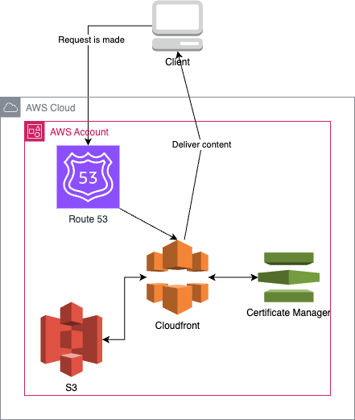

# Carson-dev.com


## Project Overview

[carson-dev.com](https://carson-dev.com) serves as a showcase of my projects and professional experience. This portfolio is built with React/Vite and attempts best practices in cloud infrastructure and continuous deployment.

### Key Features

-   **Modern Stack**: Built with TypeScript, React, and Vite.
-   **Infrastructure as Code**: All AWS infrastructure is managed using Terraform and OpenTofu.
-   **CI/CD**: Utilizes GitHub Actions for automated builds and deployments.
-   **Cloud-Native**: Deployed on AWS, with S3, CloudFront, and Route 53.

## Technology Stack

-   **Frontend**: React with TypeScript
-   **Build Tool**: Vite
-   **Runtime**: Node.js 20
-   **Infrastructure**: Terraform & OpenTofu
-   **CI/CD**: GitHub Actions
-   **Cloud Provider**: AWS

## Getting Started

### Prerequisites

-   Node.js 20
-   npm
-   AWS CLI configured with your credentials
-   Terraform or OpenTofu installed

### Local Development

1. Install dependencies:

    ```
    npm install
    ```

2. Run the development server:

    ```
    npm run dev
    ```

3. Run linter:

    ```
    npm run lint
    ```

4. Build for production:

    ```
    npm run build
    ```

## Deployment

### Automated Deployment

The project uses GitHub Actions for CI/CD. On every push to the `main` branch:

1. The UI is automatically built.
2. The build artifacts are deployed to AWS S3.

**Note**: The pipeline requires the `AWS_ACCESS_ROLE` environment variable to be set for AWS authentication.

### Infrastructure Management

All AWS infrastructure is defined as code using Terraform/OpenTofu. The infrastructure code is located in the `./infrastructure/` directory.

To manage infrastructure:

1. Navigate to the infrastructure directory:

    ```
    cd infrastructure
    ```

2. Plan changes:

    ```
    tofu plan
    ```

3. Apply changes:
    ```
    tofu apply
    ```

**Note**: Ensure you're authenticated with your AWS credentials locally before running these commands.

## Architecture

The project utilizes a serverless architecture on AWS:



Key components:

-   Route 53 for DNS management
-   CloudFront as CDN
-   S3 for static website hosting
-   Certificate Manager for SSL/TLS
